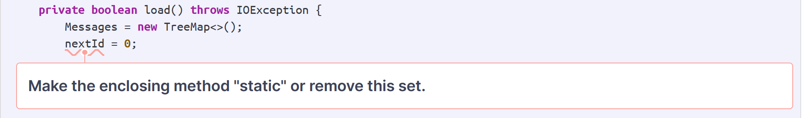

# U-Fund Food Bank Design Documentation

## Team Information
* Team name: 7g-FundsInHighPlaces
* Team members
  * Sam Pepperman
  * Charles von Goins II
  * Kelvin Ng
  * Mason Zeng

## Executive Summary
The web application, is built using the Model–View–ViewModel (MVVM) architecture pattern.

The Model stores the application data objects including any functionality to provide persistance.

The View is the client-side U-Fund page built with Angular utilizing HTML, CSS and TypeScript. The ViewModel provides RESTful APIs to the client (View) as well as any logic required to manipulate the data objects from the Model.

Both the ViewModel and Model are built using Java and Spring Framework. Details of the components within these tiers are supplied below.

Our non-for-profit is a food donation website with the ability to fund food needs to feed those who are hungry and/or in need of basics hunger necessities. 

On our website, you are greeted with a landed page depicting that we are a non-for-profit food donation website and our name 'Funds In High Places.'. Along with that, on the very top bar, you'll see one of our 10%, which are the messages a helper may add when checking out a need(s) on their helper page. 

From there, when you click on the 'login' button, it'll take you to the login page, in which you can login in as an admin, or a helper with any username conceived. 

Before entering in any username for helper, however, you must first create a username, and then once it has been processed, you can login in with that username.

Logging in with admin, you'll see that you can add, delete, and edit needs already in the cupboard. You'll also see, on the left side, that you can also see the username of the helper who donated what need and how much of it as well (another 10%).

Logging in with your respective helper username, you'll be able to add/remove a need from the cupboard to/from the funding basket for each helper. You can also search for a need as well. Once you are happy with the needs in your funding basket, you can check them out with a donation message of your choosing (you'll type it that is) and it'll be posted on the landing page top bar, so that people will know why you donated.

### Purpose

The purpose of U-Fund is to allow people to donate certain food needs to a non-profit U-Fund Organization for those in need and/or are hungry.

### Glossary and Acronyms

| Term | Definition |
|------|------------|
| Helper | Donator |
| MVP | Minimum Viable Product |
| UML | Uniform Modeling Language |
| OOP | Object Oriented Programming |
|UI| User Interface|

## Requirements

### Definition of MVP

Helpers can create an account (if they currently don't have one) with a username and login/logout to the U-Fund page. These accounts will be saved onto a file so that their progress can be saved. Helpers can browse the needs shown within the Cupboard and add these needs to the Funding Basket. They can also remove these needs from the Funding Basket and then check out all the needs in the Funding Basket. Managers will have access to the Cupboard and can add, remove, and update needs when necessary and will be alerted if a need in the Cupboard is fulfilled.

Since persistence is implemented, changes in accounts, the cupboard, notifications, and messages will be updated for all users. Each account will have access to its own "personal" funding basket. Essentially, the funding baskets of each person will depend on what's added to the funding basket.

### MVP Features

* Authentication
  * As a User, I want to be able to login and logout so that I can access the server and save my progress.

* Manager
  * As a manager, I want to facilitate the system to make sure it’s always updated and running smoothly. 

* Helper
  * As a helper, I want to add/remove items into my funding basket so I can donate to food needs.

* Data Persistence
  * As a user, I want to be able to see a user’s changes based on what they did prior in the system so that I can store the information and utilize it for what I need in the system.

* 10% Enhancement Features
  * As a manager i want more information on my needs status so i can properly reflect my current needs and as a helper i want to leave messages to feel a stronger connection to the cause.

### Enhancements

**Helper Messages**
When a helper checks out, they can write a message to include with their donation. These donation messages will then be displayed as a rotating banner on the landing page.

**Manager Notifications**
Managers will have a list displayed on their page showing the history of checkouts made by helpers in chronological order from newest to oldest. For example, "A helper checked out 3 Burgers".

## Application Domain
_This section describes the application domain._

Domain models are crucial in the software development process as they reduce the complexity of a system. These models showcase the developer's understanding of the MVP by visually displaying how the entities relate to one another.

One of our biggest entities is the Non-Profit U-Fund Page. The reason is that this is the entity that the customers interact the most. It contains other vital components such as the Cupboard, FundingBasket, and login page.

As said earlier, the U-Fund page has the Cupboard and is essential to our project. The Cupboard contains the items that the organization is looking to donate, and what makes this entity so crucial is its role as a dependency. Other important modules such as the Funding Basket and Users depend on the Cupboard. For example, the Funding Basket can only contain needs that are found in the Cupboard. For users, Helpers can search and add/remove needs from the Cupboard to the Funding Basket. Managers can edit, add, and remove needs from the Cupboard. As you can see, the functionality of other entities relies heavily on the Cupboard.

Another entity that is necessary to our project is Users. The reason is that they represent the body of those who will use our project. Briefly mentioned previously, the two types of users are helpers and managers. They both can have accounts and log in through the login page to have access to the U-Fund page. Their specific functionalities are briefly described above, but the main point is to show their importance through their use of major entities.

## Architecture and Design

### Summary

The web application, is built using the Model–View–ViewModel (MVVM) architecture pattern. 

The Model stores the application data objects including any functionality to provide persistance. 

The View is the client-side SPA built with Angular utilizing HTML, CSS and TypeScript. The ViewModel provides RESTful APIs to the client (View) as well as any logic required to manipulate the data objects from the Model.

Both the ViewModel and Model are built using Java and Spring Framework. Details of the components within these tiers are supplied below.

### Overview of User Interface

A user can log in through the login page with their account username. If they don't have an account, they can create an account which then prompts them back to the login page to log in. Once a helper logs in, they see all the needs that are in the Cupboard and can add needs to their Funding Basket by pressing the "Add to Basket" button. By pressing this, the quantity decreases by 1 in the Cupboard but adds to the Funding Basket that shows once a need is added. Pressing the remove button in the Funding Basket does the reverse effect. A helper can press the "Check Out" button to check out the needs from the funding basket which permanently updates the respective need in Cupboard's quantity.

A manager login results in a different user interface. There are two separate boxes, one that allows a need to be added. Within this box, the manager can add the attributes of the new need (name, type, quantity). Once added, the new need will show on the bottom and if desired, the manager can press the "Delete" button to remove that added need. The second box updates a need. It has the same layout as the add need box but instead, it changes the attribute values of a need instead of adding a new need. The changes are shown below.

### View Tier

Our view tier has many components and services. The first one is when our users come into contact with is our LoginComponent. This component is responsible for displaying the login page. Next, they indirectly use our AuthService to verify their credentials when they click the login button. From here, there are two options:

1.) If they are a helper, they will be redirected to the helper page that is rendered using our CupboardService. Our CupboardService also calls our HelperService to get their funding basket to retrieve all of the food needs in their funding basket. From here, a helper is able to add/remove food needs to/from their funding basket, search for food needs, and checkout their food needs stored in their funding basket.
* If a helper wants to add a food need to their funding basket, the following sequence of events will happen:

* If a helper wants to remove a food need from their funding basket, they can simply click the 'Remove From Basket' button within the funding basket, which will then activate the removeFromBasket() method in HelperPageComponent validating their removal of a food need from the funding basket.

* If a helper wants to search for a food need, they simply use the search box at the top of helper page. Upon typing in the box, our searchCupboardNeeds() method will automatically find all food needs that contain the search query (case sensitive).

* If a helper wants to checkout a food need(s), clicking 'Checkout' with needs already in the funding basket will render in HelperPageComponent via the checkOut() method. Upon submitting the checkout, the funding basket receives an alert and the checkout is validate, which then empties the basket.

2.) If they are an admin, they will be redirected to our admin page that is rendered using our AdminPageComponent. Our AdminPageComponent calls our CupboardService to retrieve all of our food needs and their respective details including cost, type, and quantity. Like the cupboard for the helper, admin can add/remove a food need from the shared cupboard list. They can also update a need(s) in the list too specifically its cost, type, and/or quantity. This functionality is once again provided by the AdminPageComponent. 

* If an admin wants to create/add a new food need, the following sequence of events will happen:

* If an admin wants to remove a food need, they can simply click the 'Delete Need' button right upon each need within the cupboard on the AdminPageComponent. The CupboardService will be called to remove the info of the food need.

* If an admin wants to modify a food need, they simply click the 'Update Need' underneath the box to update a need, which already exists in the cupboard. The CupboardService will be called to fill in the info of the current food need. 

### ViewModel Tier
Our View Model Tier comprises 6 main components: Accounts Controller, Cupboard Controller, Helper Controller, Helper Message Controller, Manager Controller, and Notification Controller.

The Accounts Controller component contains functions related to user accounts: createHelper, and getAllAccounts.
- The createHelper endpoint creates a new Helper account given a HelperAccount object, which checks if the account already exists. If it doesn’t exist, then the username of the account is saved into our data file. 
- The getAllAccounts endpoint retrieves and returns all the existing accounts in our data file.

The Cupboard Controller component contains functions related to the Cupboard of Needs: createNeed, updateNeed, deleteNeed, searchNameNeed, searchPartialName, and getAllNeeds.
- The createNeed endpoint takes a Need object and checks if a Need with that name already exists. If it doesn’t exist, then the need is saved into our data file. 
- The updateNeed endpoint takes a Need object with its updated values and saves the changes the values accordingly in our data file.
- The deleteNeed endpoint takes a unique name of a need and deletes the Need object associated with that name in our data file.
- The searchNameNeed takes a unique name of a need and returns the Need object from our data file.
- The searchPartialName endpoint takes a name and returns all the Needs that contain the given name value from our data file.
- The getAllNeeds endpoint returns all the Need objects in our Cupboard from our data file.

The Helper Controller component contains functions related to the Helper’s funding basket: addSupportedNeed, removeSupportedNeed, checkOut, and getSupportedNeeds.
- The addSupportedNeed endpoint takes a Need object and checks if the Need exists in the Cupboard. If it exists, it will be added to the Funding Basket data file.
- The removeSupportedNeed endpoint takes a unique need name and removes the Need associated with that name value from the Funding Basket data file.
- The checkOut endpoint checks out all the Needs and removes the specified quantity of Needs in the Cupboard data file and clears the user’s Funding Basket in the data file.
- The getSupportedNeeds endpoint returns all the user’s supported Needs in their Funding Basket from our data file.

The Helper Message Controller component contains functions related to the message sent by a Helper upon checkout: createHelperMessage, getHelperMessage, and getAllMessages.  
- The createHelperMessage endpoint takes a HelperMessage object and adds it to our data file.
- The getHelperMessage endpoint takes an id and searches for a HelperMessage object associated with the id and returns it from the data file if it exists.
- The getAllMessages endpoint returns all the HelperMessage objects from our data file.

The Manager Controller component contains functions related to a manager’s functionality: getAllNeeds, addFoodNeed, removeFoodNeed, and editFoodNeed.
- The getAllNeeds endpoint returns all the Need objects in our Cupboard from our data file.
- The addFoodNeed endpoint takes a Need object and checks if a Need with that name already exists. If it doesn’t exist, then the need is saved into our data file. 
- The removeFoodNeedendpoint takes a unique name of a need and deletes the Need object associated with that name in our data file.
- The editFoodNeed endpoint takes a Need object with its updated values and saves the changes of the values accordingly in our data file.

The Notification Controller component contains functions related to the notifications displayed on the Manager page upon Helper checkout: createNotification, getNotification, and getAllNotifications.  
- The createNotification endpoint takes a Notification object and saves it to our data file.
- The getNotification endpoint takes an id and searches for a HelperMessage object associated with the id and returns it from the data file if it exists.
- The getAllNotifications endpoint returns all the HelperMessage objects from our data file.

### Model Tier

We have 7 main modules which are the Accounts, HelperMessage, Notifications, Users, Cupboard, Needs, and SupportedNeed. Cupboard, SupportedNeed, and Users all share a dependency on Needs. Needs contain a name, the unique identifier, type, and quantity. Cupboard and SupportedNeed classes both contain needs while the User classes can add/remove/edit needs by utilizing methods from the Cupboard class. The SuppportedNeed class contains methods, to get the username of the helper who login in, get their supported needs and their quantity.

We have 3 User classes, Users.java, Helper.java, and Manager.java. Both the Helper and Manager classes extend from the Users class as they both share browsing needs and get all needs methods. The specific classes themselves hold functionality that only they can do. For example, only helpers can access the funding basket while managers can manipulate needs within the cupboard.

There are 2 account types as intended by the Account Types enum, HelperAccount and ManagerAccount. The HelperAccount and ManagerAccount classes implement the UserAccount interface where an account must have a String username and an AccountType type. Those who use helper accounts to log in can utilize the Helper functionality and manager accounts can respectively utilize Manager functionality.

We added the Notification class which provides the backend functionality of a notification. Each notification will have an ID as a unique identifier and contain the username and message after a helper checks out the funding basket. Only the manager has access to the notifications.

The last 2 model classes we added for Sprint 3 are HelperMessage and HelperMessageSet. In HelperMessage, we have the data for a message. The ID as the unique identifier for the message, the username of the helper who sent the message, and the actual message. In HelperMessageSet, it contains the list of all messages as an array list. In this class, you are also able to create a message and add it to this set of messages.

## OO Design Principles

**Single Responsibility Principle**
One design principle that our code adheres to is the Single Responsibility principle. Essentially, this principle says that each class should have one specific function. All the data required to do this function is encapsulated within this one class.

We showcase this in our design as we separate modules into smaller components. In this sense, each component can have a specific functionality. For example, multiple users will use this application and we could put all user functionality in one class. However, putting all the user services in one class violates the single responsibility principle as each user type has a different functionality. Helpers can access the funding basket whereas admins are unable to. However, admins can update, add, and remove needs to the cupboard which is off-limits to helpers. Because the two components contain different functionalities, we must follow the single responsibility principle and separate them into different classes. This need for single responsibility for helpers and admins extends to the objects they interact with. The admin directly interfaces with the cupboard and utilizes the needs class. Meanwhile, the helper modifies its fundingbasket as an object that holds supportedNeeds objects. So each class has a single responsibility associated with interfacing with the respective need types and containers.

We also utilize this principle in other areas such as the model controller classes which are separated by the type of API requests they handle. Such as all HTTP requests that are received from the AdminService are solely handled by the ManagerController.
In unit testing, we separate them based on what class the code is testing instead of putting all test cases for the application in one file. By following the single responsibility principle, we can easily manage concurrent modifications and understand the scope of a change in a class. 

This principle is also shown in the View tier as the services and components are separated by responsibility. For example, we seprated the application to different components such as, authentication, helper-page, and admin-page. The services were also separted in such fashion.

**Dependency Injection**
Another design principle that our code follows is the Dependency Injection Principle. It states that high-level modules should not depend on low-level modules but rather abstractions. The purpose of doing so is to loosen the coupling between modules. 

In our application, we used this principle many times by injecting a DAO interface between the model file DAO class and its respective controller. For example, CupboardFileDAO.java implements an interface named CupboardDAO. The Cupboard Controller does not internally instantiate the CupboardFileDAO object but rather takes it externally as a parameter in the constructor. This is the Spring Framework injecting an object to reduce coupling. Practically, if the Cupboard were to break, we would not need to worry too much about the Cupboard Controller since they are not tightly coupled. 

We improved in this principle as we were injecting the wrong component as of Sprint 2. Instead of injecting the DAO that was to be implemented by the FileDAO, we had it that the DAO was implemented by the model classes. In Sprint 3 and 4 we fixed it so that this was no longer the case.

**Information Expert**
Our model also adheres to the information expert principle. The information expert principle being the responsibility of completing a task that requires information is handled by the class that has that information and not handled by a different function requesting the data to do the operation.

For example, in the Cupboard class, the cupboard is given the responsibility of maintaining the storage of Needs that an organization desires. Because the shopping cart object holds the needs array list, we can assign it the responsibility of adding removing, and editing needs while also being able to browse the needs within the cupboard. This keeps the class UML diagram simple and easy to understand without creating complications. For example, if an admin wants to delete a need from the cupboard, the Cupboard class can check whether the item exists in the cupboard by searching through its list of needs. If the need is found, the Cupboard class can remove it from the cupboard, as it holds the necessary information about the item. This creates a much simpler operation that is more secure instead of having the admin request the list of all needs and then independently verifying if the need it wants to delete is in the list and then submitting the delete request. By having all operations handled in the cupboard the process is much simpler.

**Controller**
Within our project, we implemented multiple controllers, each in charge of a different functionality. It is incorporated in the View Model tier since it is the mediator between the user interface and the model. Some examples are AccountsController.java which is in charge of the type of account that's being logged in (Helper or Manager), and CupboardController.java, which is in charge of making the changes within the cupboard. We also implemented controllers for our enhancement features, HelperMessageController.java and Notification.java. What all of these have in common is that they are prompted by changes in the view. When a helper or manager makes a change to the view, the controllers make the changes in the model. Having controllers separates the View Model tier from the View tier and Model tier.

We improved with this aspect since one of our controllers was not functioning correctly. Up until Sprint 2, our Helper Controller was not working so we had to recreate the Helper Controller to make it work properly. We were able to refactor Helper Controller so that it was able to correctly do cuRL commands during Sprint 3.

## Static Code Analysis/Future Design Improvements
Area 1: Static variable modified by a non-static method

Ensuring the value of a static element remains the expected value when refrenced from a non-static method can be difficult. If several threads, or multiple class instances, are active at a time it becomes very easy for the static element to be set incorrectly and cause an error to cascade through all object relient on said static element. This issue can be rectified by having the calling method be a synchronized static method as shown below:

Area 2: Utilizing the Map.computeIfAbsent() method

Currently, our code first gets a value then checks to see of that value is null. By using the computeIfAbsent() method, this can be streamlined and make the code much easier to read. Since the java util API already contains this functionality it is best practice to make use of the tools that complete the task most efficiently. The code refactored to utilize the computeIfAbsent() method is shown below:

Area 3: Returning an empty element instead of null

Returning null to a method that expects a returned object causes anything calling the method for the response to do null checking to avoid null ponter errors. This extra checking makes the prgram more complex and reduces readability. This can be resolved by instead returning an empty element as seen in the code below:

**Future Design Improvements**:
The helper's ability to add and remove elements from the funding basket lacks usability options that could be added in the future. Ideally, the ability to add and remove needs in a higher volume than 1 item at a time would be valuable for users who desire to make large contributions.

If we had more time we could simplify the design we implemented for need management between helper and admin. As it is now, we generated different classes to be the cupboard and the funding basket and each holds a unique object of needs and supportedNeeds respectively. Given the time needed to refactor, the helper functionality could be fully implemented by using cupboards and needs and forgoing the fundingbasket and supported needs code entirely. With this, the cupboard and needs elements could be reused throughout the project and reduce redundant code that performs the same action for both types of specialized objects.

The restrictions for the creation and updating of needs could be expanded in the future. As it is now, the cost and quantity are the only elements checked to ensure they are higher than zero. Meanwhile, the food needs can have names and types that make no logical sense for the idea of them being food needs. For instance, the Need could be named "123" and have type "123". This issue could be remedied by adding a validator to the input to ensure every element is a character as a minimum check for the fields.

A future design improvement for usability could be having a total cost display for the funding basket of a helper. Since each item in the funding basket already contains its cost per unit and quantity, the total cost to check out the funding basket could be calculated with very little issue. This display lets the user more easily know the amount to be donated.

## Testing

### Acceptance Testing

Acceptance Criteria for Sprints 1 and 2 have been written and fully tested. We will start writing the Acceptance Criteria for the 10% features and data persistence after the Sprint 2 Demo. 

As of Sprint 4, we have a total of 37 acceptance tests. We were able to test all acceptance tests and out of these 37, only 7 failed. We had minor bugs with our UI which led to some failures with our testing. Unfortunately, we did not have the time to resolve these issues. However, the other 30 acceptance tests successfully passed during testing.

### Unit Testing and Code Coverage

When creating unit tests, we focused on making sure that the most critical features had nearly all, if not all, branches covered. We deemed all MVP features critical and aimed for nearly 100% code coverage in terms of missed instructions and at least 90% in missed branches. We had very high standards as we wanted to make sure that our code was bug-free and worked for all possible cases.

We were very close to our goal as we had an overall code coverage of 98% for missed instructions and a code coverage of 90% for missed branches. Our model and controller classes had high code coverages with the model classes having a code coverage of 99% and the controller classes having a code coverage of 100% in missed instructions.

Most of our lower code coverages were located in the persistence folder. The reason is that we did not have a test case for the condition statements within the "getArray()" functions. As a result, the code coverage for missed branches in persistence took a hit and had an average of 81%. However, the code coverage for missed instructions in persistence was high with a code coverage of 96%.

It may seem peculiar since the report claims that we have 0% on "HelperFileDAO.new TypeReference() {...}" but as shown in the overall code coverage, it does not play a vital part. We utilized "Type Reference" which makes an anonymous class when running Jacoco. As a result, we were unable to provide tests to cover that area as the "class" was not a file but only temporarily created when running Jacoco.

For the future, we plan to spend more time making sure that all conditions within our code are covered as they are a core reason why our code coverage for missed branches is so high.

**Overall Code Coverage**

**Controller Code Coverage**

**Model Code Coverage**

**Persistence Code Coverage**

